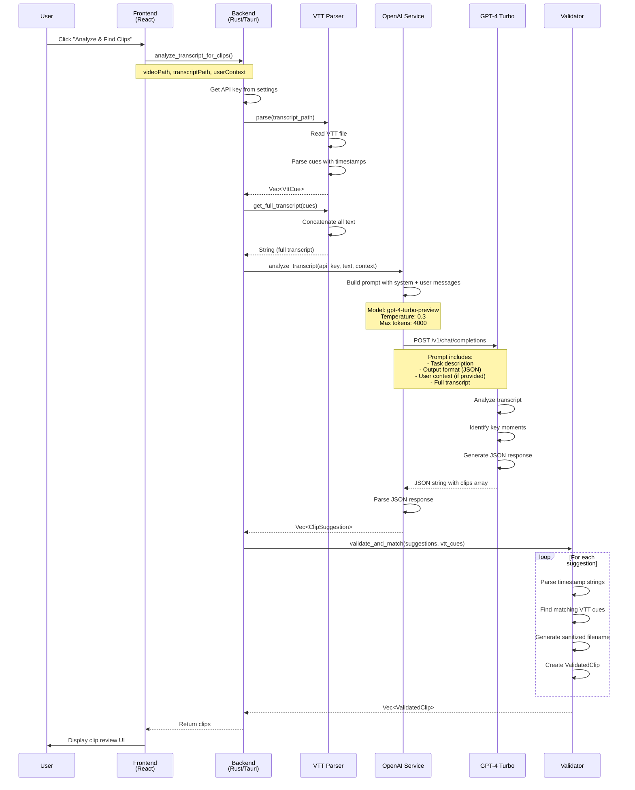
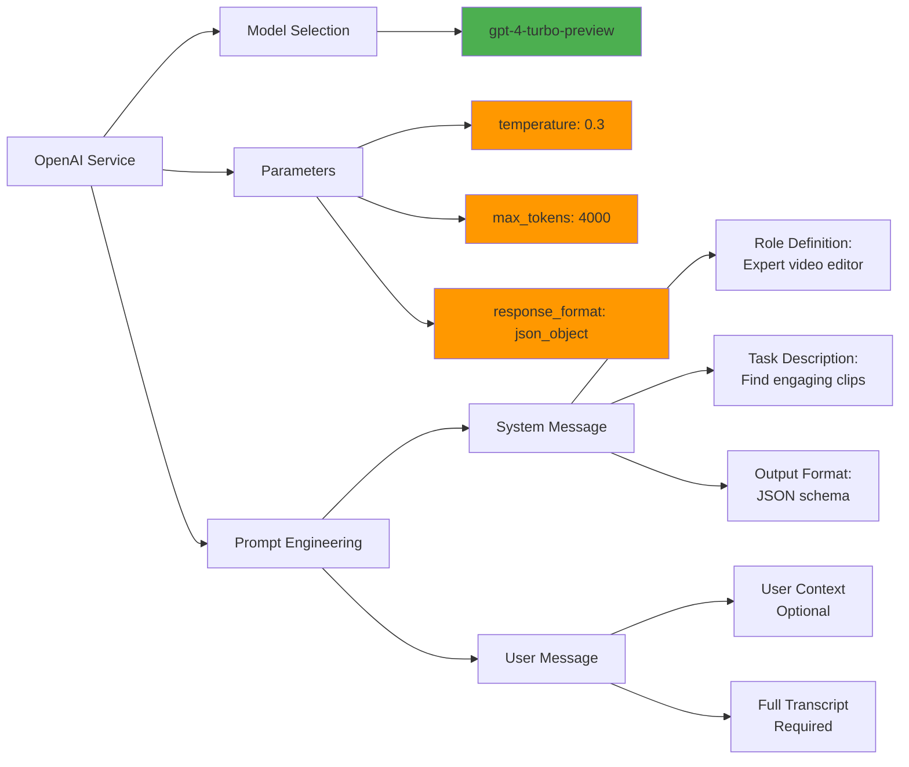
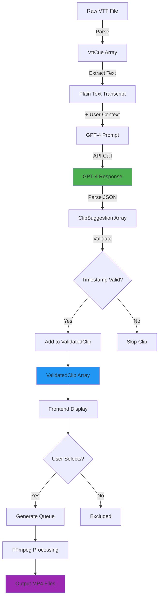
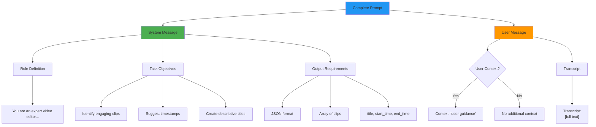
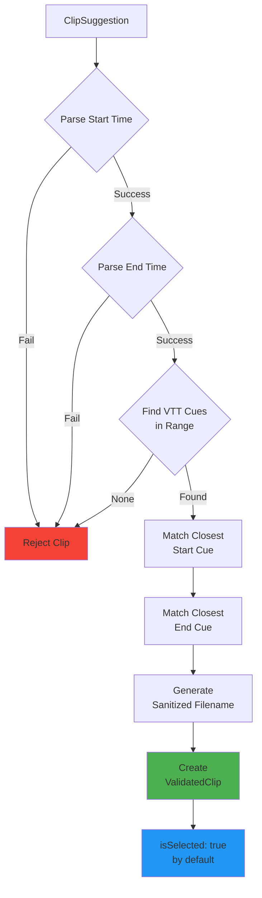

# Clip Selection Architecture

This document details how ClipScribe currently selects and generates video clips.

## 1. High-Level System Flow

## 2. Detailed Analysis Flow

## 3. AI Model Configuration

## 4. Data Flow & Transformations

## 5. Current Prompt Structure

## 6. Timestamp Validation Process

## Current Issues & Limitations

### 1. Model Selection
- **Fixed Model**: `gpt-4-turbo-preview` hardcoded
- **No fallback**: If model unavailable, fails
- **No cost optimization**: Always uses most expensive model

### 2. Prompt Engineering
- **Generic prompt**: Same for all video types
- **Limited context**: Only optional user input, no video metadata
- **No examples**: No few-shot learning examples
- **No constraints**: Doesn't specify clip length preferences

### 3. Validation Logic
- **Simple matching**: Just finds nearest VTT cue
- **No quality check**: Doesn't verify if timestamp makes sense
- **No duration limits**: Could suggest very short or very long clips
- **No overlap detection**: Multiple clips could overlap

### 4. User Control
- **All or nothing**: User can only select/deselect
- **No editing**: Can't adjust timestamps
- **No re-analysis**: Must start over to change context
- **Auto-select all**: Everything selected by default

## Improvement Opportunities

### High Priority
1. **Dynamic prompt engineering** based on video type/context
2. **Clip length constraints** (min/max duration)
3. **Quality scoring** for suggestions
4. **Better timestamp validation** with content awareness

### Medium Priority
5. **Model selection** based on video length/complexity
6. **Few-shot examples** in prompt
7. **Overlap detection** and resolution
8. **User feedback loop** for prompt refinement

### Low Priority
9. **Multiple model comparison** (A/B testing)
10. **Caching** for repeated analyses
11. **Incremental analysis** for long videos
12. **Custom prompt templates** by use case

---

**Next Steps**: Review these diagrams and identify which areas to improve first.
