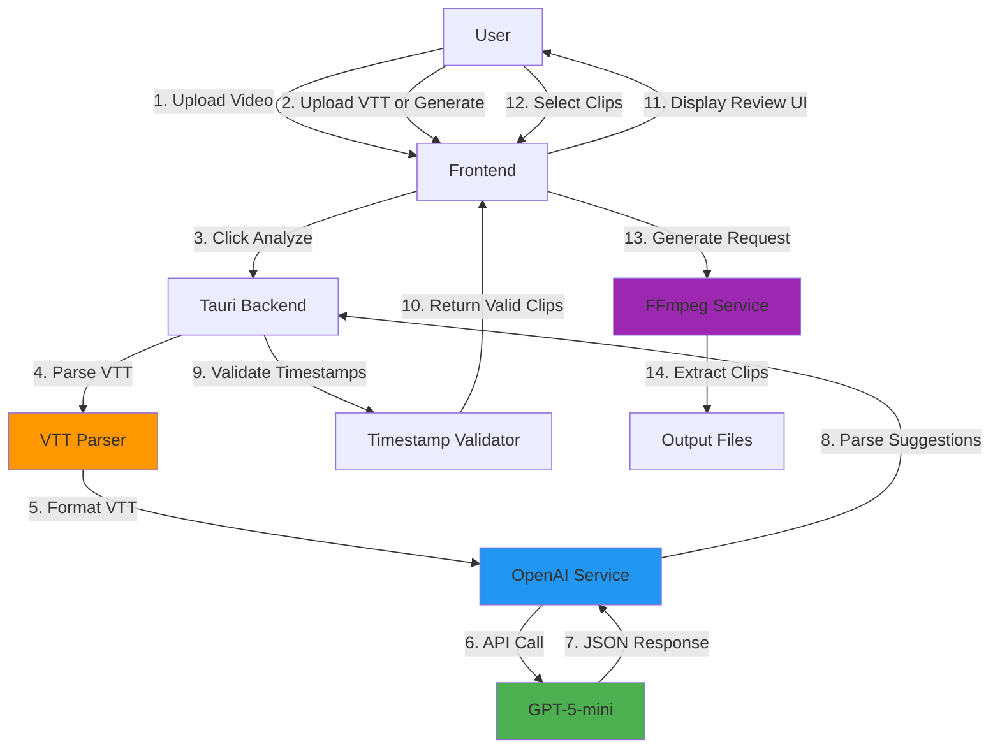
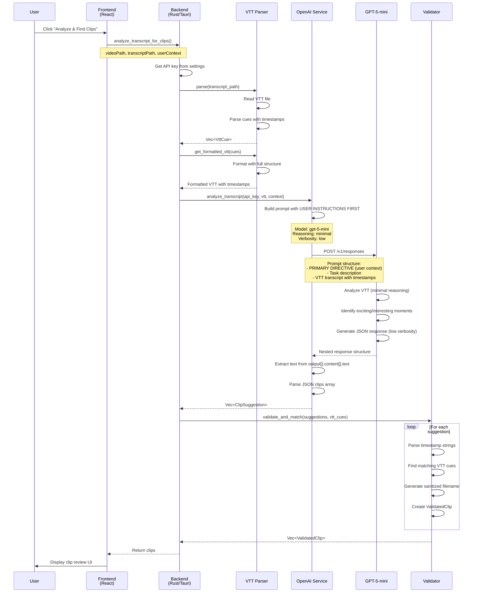
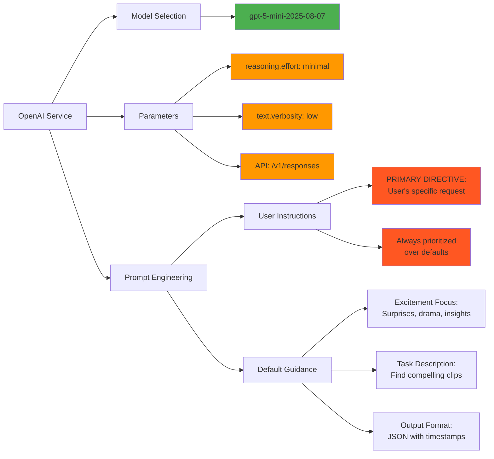
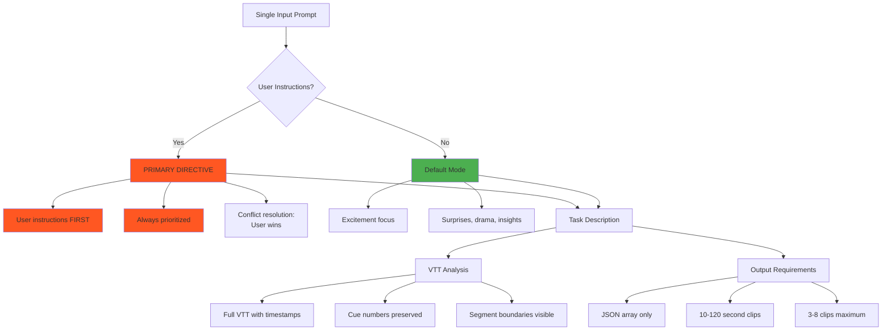
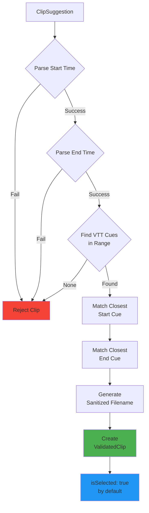

# Clip Selection Architecture

This document details how ClipScribe currently selects and generates video clips.

## 1. High-Level System Flow



## 2. Detailed Analysis Flow



## 3. AI Model Configuration



## 4. Data Flow & Transformations

```mermaid
graph TD
    A[Raw VTT File] -->|Parse| B[VttCue Array]
    B -->|Format with Structure| C[Formatted VTT]
    
    C -->|+ User Instructions| D[GPT-5 Prompt]
    D -->|API Call| E[GPT-5 Response]
    E -->|Extract from nested| F[output[].content[].text]
    F -->|Parse JSON| G[ClipSuggestion Array]
    
    G -->|Validate| H{Timestamp Valid?}
    H -->|Yes| I[Add to ValidatedClip]
    H -->|No| J[Skip Clip]
    
    I --> K[ValidatedClip Array]
    K --> L[Frontend Display]
    L --> M{User Selects?}
    M -->|Yes| N[Generate Queue]
    M -->|No| O[Excluded]
    
    N --> P[FFmpeg Processing]
    P --> Q[Output MP4 Files]
    
    style E fill:#4CAF50
    style K fill:#2196F3
    style Q fill:#9C27B0
```

## 5. Current Prompt Structure (GPT-5)



## 6. Timestamp Validation Process



## Current Status & Remaining Limitations

### ✅ Resolved (v1.2.0)
1. **Model Selection** - Now uses GPT-5-mini with minimal reasoning for cost optimization
2. **User Priority** - User instructions now ALWAYS prioritize over default prompts
3. **VTT Awareness** - AI analyzes full VTT structure with timestamps
4. **Excitement Focus** - New default prompt finds compelling moments
5. **Clip Constraints** - Now enforces 10-120 second length, 3-8 clips

### ⚠️ Still Limited
1. **No fallback model** - If GPT-5-mini unavailable, hard fails
2. **Simple validation** - Just finds nearest VTT cue, no quality scoring
3. **No overlap detection** - Multiple clips could overlap
4. **Auto-select all** - Everything selected by default
5. **No clip editing** - Can't adjust timestamps in UI
6. **No re-analysis** - Must start over to change context

## Next Improvements (Priority Order)

### High Priority
1. **Clip quality scoring** - Rank clips by importance/interest level
2. **Overlap detection** - Warn or auto-resolve overlapping clips
3. **Better defaults** - Don't auto-select all clips
4. **Dynamic reasoning** - Adjust effort based on video complexity

### Medium Priority
5. **Few-shot examples** - Include example outputs in prompt
6. **Video type detection** - Adjust prompt for meetings, tutorials, vlogs
7. **Metadata injection** - Pass video duration, topics to AI
8. **Fallback model** - Use gpt-4o if gpt-5-mini unavailable

### Low Priority
9. **Clip editing UI** - Adjust timestamps before generation
10. **Re-analysis** - Change context without re-uploading
11. **Caching** - Save analyses for repeated use
12. **A/B testing** - Compare different prompt strategies

---

**Next Steps**: Review these diagrams and identify which areas to improve first.
